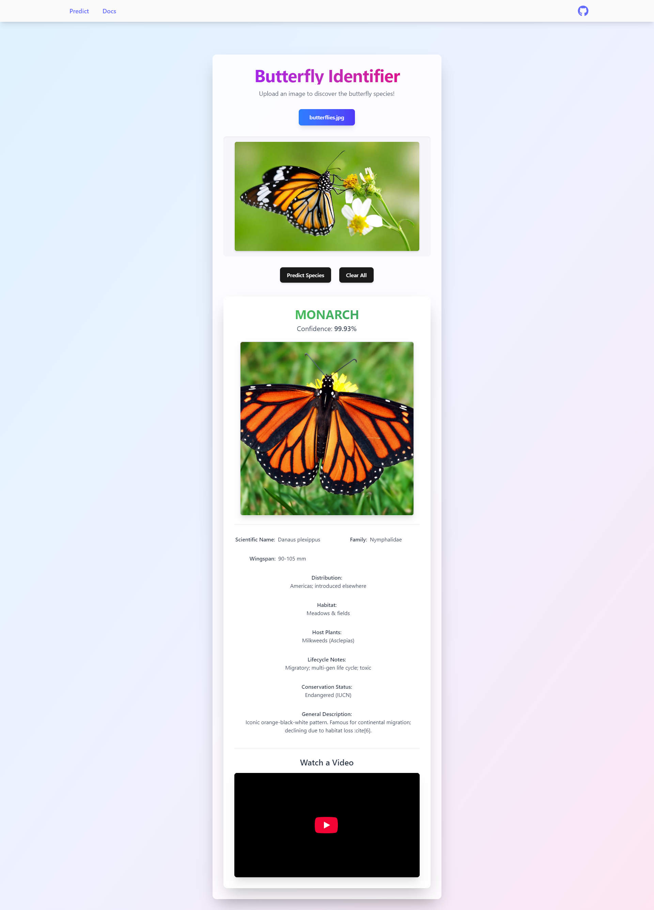

# Butterfly Classification Project

This project is a web application that uses a deep learning model to classify butterfly species from images.

## Web App Screenshots

_Add screenshots of the web application here. Images should be placed in the `docs/images` directory._




## How the Model Works

The butterfly classification model is built using deep learning techniques. Here's a breakdown of how it works:

### Model Architecture

*   **Base Model:** The model utilizes the MobileNetV2 architecture, pre-trained on the ImageNet dataset, as its foundational feature extractor. MobileNetV2 is known for its efficiency and effectiveness in image classification tasks.
*   **Custom Classifier:** On top of the MobileNetV2 base, a custom classifier is added. This typically includes:
    *   A `GlobalAveragePooling2D` layer to reduce the spatial dimensions of the features.
    *   Dense (fully connected) layers with ReLU activation for learning higher-level representations.
    *   Dropout layers to prevent overfitting.
    *   A final Dense layer with softmax activation to output probabilities for each butterfly species (75 classes in this dataset).
*   **Transfer Learning:** The top 50 layers of the MobileNetV2 base model are unfrozen and fine-tuned during training to adapt the learned features to the specific task of butterfly classification.

### Data Preprocessing and Augmentation

1.  **Loading Data:** The training data is loaded from a CSV file (`Training_set.csv`) which contains filenames and corresponding labels.
    *   The dataset used for training is sourced from Kaggle (Butterfly Image Classification).
2.  **Image Resizing:** All images are resized to a target size of 224x224 pixels to ensure consistency for the model input.
3.  **Class Balancing and Augmentation:** To address class imbalance and increase the diversity of the training set, the following data augmentation techniques are applied using `ImageDataGenerator`:
    *   Rotation (up to 15 degrees)
    *   Width and height shifts (up to 10%)
    *   Horizontal flips
    *   The `fill_mode='nearest'` is used to fill in any pixels that might be lost during augmentation.
    *   The dataset is balanced to have approximately `AUG_PER_CLASS` (e.g., 100) images per class by generating augmented images for classes with fewer samples.
4.  **Data Splitting:** The balanced dataset is split into training and validation sets (e.g., 80% training, 20% validation).
5.  **Normalization:** Image pixel values are rescaled from the [0, 255] range to the [0, 1] range by dividing by 255.0.

### Training Process

*   **Optimizer:** The Adam optimizer with a learning rate of 1e-4 is used.
*   **Loss Function:** Categorical cross-entropy is employed as the loss function, suitable for multi-class classification problems.
*   **Metrics:** Accuracy is monitored during training.
*   **Callbacks:**
    *   `ModelCheckpoint`: Saves the best model based on validation accuracy.
    *   `EarlyStopping`: Stops training if the validation performance doesn't improve for a certain number of epochs (patience=5), restoring the best weights.
    *   `ReduceLROnPlateau`: Reduces the learning rate if the validation loss plateaus.
*   **Training Environment:** The model is trained on a TPU (Tensor Processing Unit) for accelerated computation where available; otherwise, it falls back to the default strategy (GPU/CPU).

### Prediction in the Web App

1.  **Image Input:** The user uploads an image of a butterfly through the web application.
2.  **Preprocessing:** The uploaded image undergoes the same preprocessing steps as the training data (resizing to 224x224, normalization).
3.  **Model Prediction:** The preprocessed image is fed into the trained model, which outputs a probability distribution over the 75 butterfly classes.
4.  **Output:** The class with the highest probability is determined as the predicted butterfly species. The class indices (mapping class names to numerical indices) are loaded from `class_indices.json` to translate the predicted index back to the species name. This prediction is then displayed to the user.

The model training details and code can be found in the Jupyter Notebook: `Notebook/butterfly-classification-imagenetv2.ipynb`.

## Technologies Used

*     **Programming Language:** Python
*     **Backend Framework:** Flask (for the prediction API)
*     **Machine Learning:** TensorFlow & Keras (for model building and training)
*     **Frontend Library:** React (for the user interface)
*     **Styling:** Tailwind CSS (for frontend styling)
*    **Build Tool:** Vite (for frontend development and bundling)
*    **Notebook Environment:** Jupyter Notebook (for model development and experimentation)
*   **Image Processing:** Pillow (PIL), Matplotlib, Seaborn
*   **Numerical Computation:** NumPy
*   **Data Handling:** Pandas

## Setup and Installation

To get this project up and running on your local machine, follow these steps:

### Prerequisites

*   Python 3.8 or higher
*   Node.js and npm (or yarn)

### Backend Setup (Flask API)

1.  **Clone the repository:**
    ```bash
    git clone https://github.com/HimanM/Butterfly-Predict.git
    cd Butterfly-Predict
    ```

2.  **Create and activate a virtual environment (recommended):**
    ```bash
    python -m venv venv
    # On Windows
    # venv\Scripts\activate
    # On macOS/Linux
    # source venv/bin/activate
    ```

3.  **Install Python dependencies:**
    The main dependencies are Flask and TensorFlow. You'll also need Pillow for image manipulation and NumPy.
    ```bash
    pip install Flask tensorflow Pillow numpy Werkzeug
    ```
    *Ensure you have the necessary build tools for TensorFlow if installing from source (usually handled by pip).*

4.  **Download/Place the Model and Class Indices:**
    *   The trained model `butterfly_classifier.keras` should be placed in the `model/` directory in the project root.
    *   The `class_indices.json` file (mapping class names to indices) should also be in the `model/` directory.

5.  **Run the Flask API:**
    The API server will typically run on `http://localhost:5000`.
    ```bash
    python app.py
    ```
    You should see a message indicating that the "ButterflyPredictor initialized successfully."

### Frontend Setup (React App)

1.  **Navigate to the frontend directory:**
    ```bash
    cd butterfly_web 
    ```

2.  **Install Node.js dependencies:**
    ```bash
    npm install
    ```

3.  **Run the React development server:**
    The React app will usually start on `http://localhost:5173` (Vite's default) or `http://localhost:3000` (Create React App's default). Check your `package.json` or terminal output for the exact port.
    ```bash
    npm run dev
    ```

### Accessing the Application

Once both the backend API and frontend development server are running:

1.  Open your web browser and navigate to the frontend URL (e.g., `http://localhost:5173`).
2.  You should be able to upload an image and get a butterfly species prediction.

**Note:** The frontend application (`butterfly_web/src/App.jsx` or similar) will likely make API calls to the Flask backend at `http://localhost:5000/predict`. Ensure this endpoint is correctly configured if you change the backend port.

## Project Structure

Here's a brief overview of the key directories and files in the project:

```
├── .gitignore
├── ADONIS_10.jpg                 # Sample image (likely for testing)
├── ButterflyDataHandle.py        # Python script for data handling (details needed)
├── ButterflyPredictor.py       # Python script defining the predictor class/logic
├── Notebook/
│   └── butterfly-classification-imagenetv2.ipynb # Jupyter Notebook for model training
├── PredictorService.py           # Service layer for predictions, used by app.py
├── app.py                        # Main Flask application file for the backend API
├── butterfly_data/
│   ├── data.csv                  # CSV containing butterfly image data and labels
│   ├── images/                   # Directory containing original butterfly images
│   └── test.py                   # Test script for butterfly_data (details needed)
├── butterfly_download_script.py  # Script for downloading butterfly data (likely)
├── butterfly_web/                  # Frontend React application
│   ├── public/                   # Public assets for the frontend
│   ├── src/                      # Source code for the React app
│   │   ├── App.jsx               # Main React application component
│   │   ├── components/           # Reusable React components
│   │   └── pages/                # Page components for different routes
│   ├── package.json              # Frontend dependencies and scripts
│   └── vite.config.js            # Vite configuration for the frontend
├── model/
│   ├── butterfly_classifier.keras # The trained Keras model file
│   └── class_indices.json        # JSON file mapping class indices to species names
├── uploads/                      # (Created by app.py) Temporary folder for uploaded images
├── utils/                        # Utility scripts
└── README.md                     # This file
```

## Contributing

Contributions are welcome! If you have suggestions for improvements, new features, or bug fixes, please feel free to:

1.  **Fork the repository.**
2.  **Create a new branch** for your feature or fix:
    ```bash
    git checkout -b feature/your-feature-name
    ```
3.  **Make your changes** and commit them with clear messages.
4.  **Push to your branch:**
    ```bash
    git push origin feature/your-feature-name
    ```
5.  **Open a Pull Request** against the `main` (or `master`) branch of this repository.

